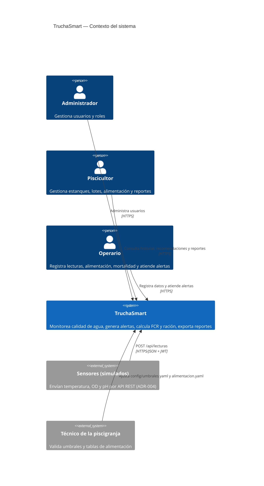

# C4 · Nivel 1 — Diagrama de contexto

```mermaid
C4Context
    title TruchaSmart — Contexto del sistema
    Person(admin, "Administrador", "Gestiona usuarios y roles")
    Person(pisci, "Piscicultor", "Gestiona estanques, lotes, alimentación y reportes")
    Person(oper, "Operario", "Registra lecturas, alimentación, mortalidad y atiende alertas")
    System(ts, "TruchaSmart", "Monitorea calidad de agua, genera alertas, calcula FCR y ración, exporta reportes")
    System_Ext(sensor, "Sensores (simulados)", "Envían temperatura, OD y pH por API REST (ADR-004)")
    System_Ext(tecnico, "Técnico de la piscigranja", "Valida umbrales y tablas de alimentación")

    Rel(admin, ts, "Administra usuarios", "HTTPS")
    Rel(pisci, ts, "Consulta historial, recomendaciones y reportes", "HTTPS")
    Rel(oper, ts, "Registra datos y atiende alertas", "HTTPS")
    Rel(sensor, ts, "POST /api/lecturas", "HTTPS/JSON + JWT")
    Rel(tecnico, ts, "Ajusta config/umbrales.yaml y alimentacion.yaml")
```
