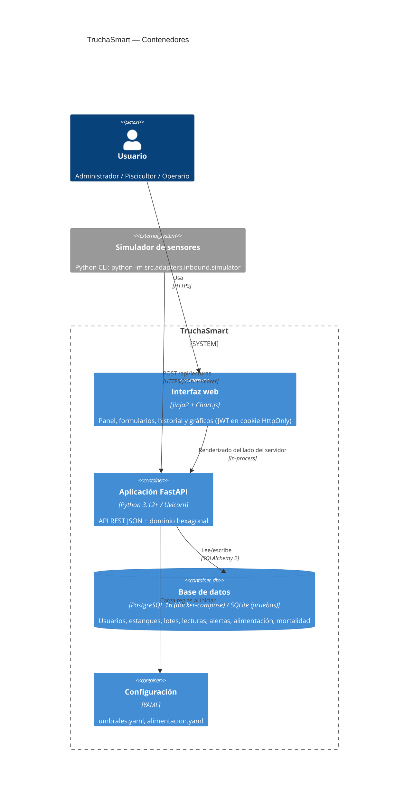

# C4 · Nivel 2 — Diagrama de contenedores

```mermaid
C4Container
    title TruchaSmart — Contenedores
    Person(usuario, "Usuario", "Administrador / Piscicultor / Operario")
    System_Ext(sim, "Simulador de sensores", "Python CLI: python -m src.adapters.inbound.simulator")

    System_Boundary(ts, "TruchaSmart") {
        Container(web, "Interfaz web", "Jinja2 + Chart.js", "Panel, formularios, historial y gráficos (JWT en cookie HttpOnly)")
        Container(api, "Aplicación FastAPI", "Python 3.12+ / Uvicorn", "API REST JSON + dominio hexagonal")
        ContainerDb(db, "Base de datos", "PostgreSQL 16 (docker-compose) / SQLite (pruebas)", "Usuarios, estanques, lotes, lecturas, alertas, alimentación, mortalidad")
        Container(cfg, "Configuración", "YAML", "umbrales.yaml, alimentacion.yaml")
    }

    Rel(usuario, web, "Usa", "HTTPS")
    Rel(web, api, "Renderizado del lado del servidor", "in-process")
    Rel(sim, api, "POST /api/lecturas", "HTTPS/JSON + Bearer")
    Rel(api, db, "Lee/escribe", "SQLAlchemy 2")
    Rel(api, cfg, "Carga reglas al iniciar")
```
